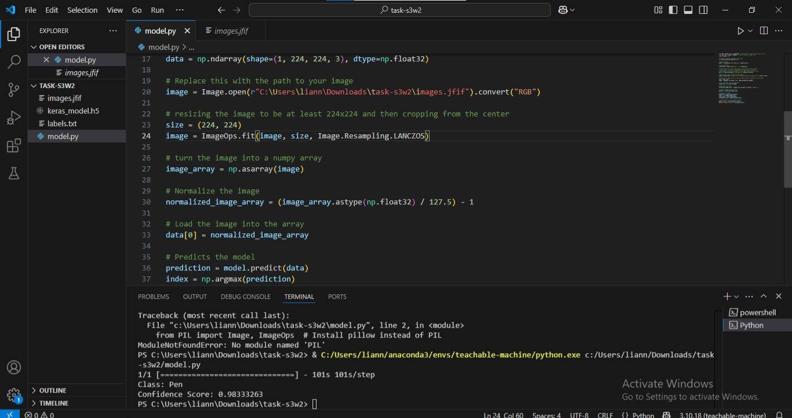

# pen-ereaser-classification
w2 s3 task4

# 🖊️ نموذج تصنيف الصور: قلم أم ممحاة؟

هذا المشروع هو عبارة عن نموذج ذكاء اصطناعي لتصنيف الصور، تم تدريبه للتمييز بين صور **الأقلام (Pen)** و**المماحي (Eraser)**. تم بناء النموذج باستخدام منصة Teachable Machine من Google وتنفيذه باستخدام لغة بايثون.

---

## 🛠️ التقنيات المستخدمة

* **Google's Teachable Machine:** لتدريب نموذج تصنيف الصور بسهولة.
* **Python:** لتشغيل النموذج والتنبؤ بالصور الجديدة.
* **TensorFlow / Keras:** كإطار عمل للتعلم العميق الذي تم تصدير النموذج به.
* **Pillow (PIL) & OpenCV:** لمعالجة الصور وتحضيرها قبل إدخالها للنموذج.

---

## 🚀 كيفية التشغيل

لتشغيل هذا المشروع على جهازك، اتبع الخطوات التالية:

1.  **تثبيت المكتبات المطلوبة:**
    تأكد من أنك قمت بتثبيت المكتبات اللازمة في بيئة العمل الخاصة بك. يمكنك تثبيتها باستخدام `pip`:
    ```bash
    pip install tensorflow Pillow opencv-python
    ```

2.  **تعديل مسار الصورة:**
    افتح ملف `model.py` وقم بتغيير مسار الصورة في السطر التالي إلى مسار الصورة التي تريد اختبارها على جهازك:
    ```python
    # Replace this with the path to your image
    image = Image.open("path/to/your/image.jpg").convert("RGB")
    ```

3.  **تشغيل الكود:**
    قم بتشغيل الكود من خلال الـ Terminal:
    ```bash
    python model.py
    ```

---

## 🎯 النتائج

عند تشغيل الكود على صورة قلم، كانت النتيجة كما في الصورة التالية، مع درجة ثقة عالية.



**النتيجة:**
* **الصنف:** Pen
* **درجة الثقة:** ~98%

